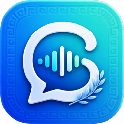
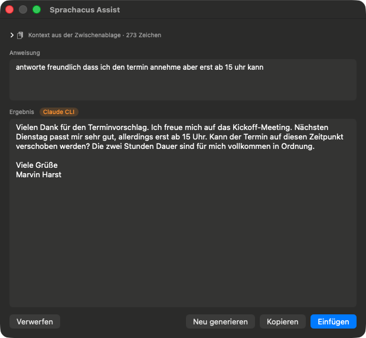
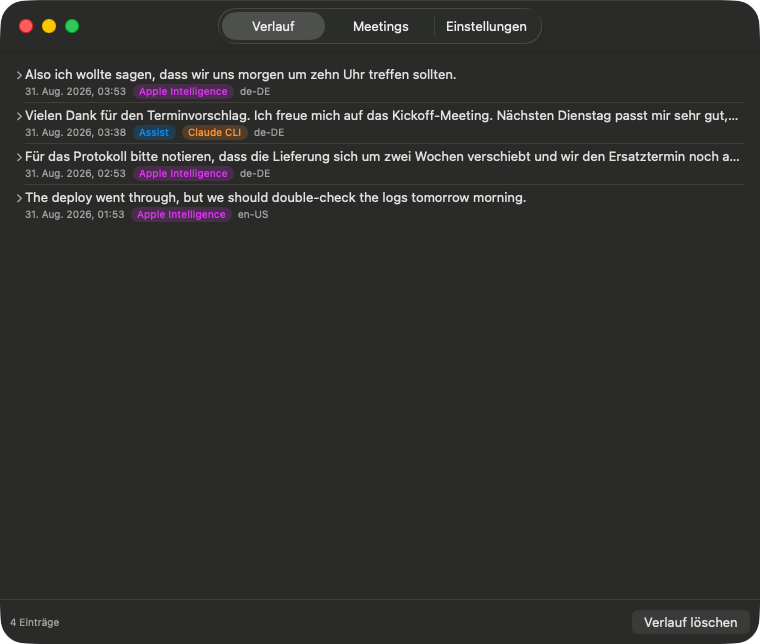
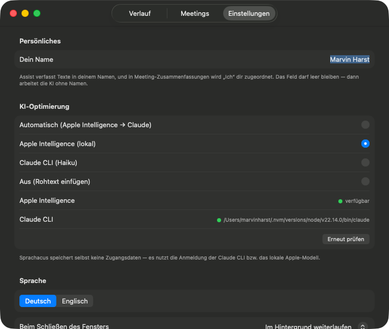

<p align="center">
  
</p>

<h1 align="center">Sprachacus</h1>

<p align="center">
  Lokale Diktier-App für macOS 26+ mit KI-Textkorrektur, Schreibassistent und Meeting-Transkription.<br>
  Transkribiert vollständig auf dem Gerät — ohne Abo-Zwang und ohne Cloud-Upload der Aufnahmen.
</p>

<p align="center">
  
  
  
  
</p>

> **English:** A local dictation app for macOS 26+. Tap the right ⌥ key, speak, tap again — the text is
> transcribed on-device, cleaned up by an LLM and pasted where your cursor is. Also does clipboard-aware
> drafting (⌥⌥) and meeting transcription with separate microphone/system-audio channels.
> The UI and prompts are German by default; English is selectable in the settings.

## Voraussetzungen

- **macOS 26 (Tahoe) oder neuer**, Apple Silicon — die App nutzt das mit macOS 26 eingeführte `SpeechAnalyzer`-Framework
- **Xcode Command Line Tools 26+** (`xcode-select --install`) zum Bauen; kein Xcode-Projekt nötig
- Optional **Apple Intelligence** für die lokale Textkorrektur
- Optional die **[Claude Code CLI](https://claude.com/claude-code)** (mit Abo oder API-Guthaben) für den Assist-Modus und Meeting-Zusammenfassungen

Ohne beide KI-Optionen funktioniert das reine Diktat weiterhin — der Text wird dann unkorrigiert eingefügt.
`make setup` prüft all das und sagt, was fehlt.

**Diktat:** Rechte ⌥ (Option) drücken → sprechen (Overlay mit Waveform am unteren Bildschirmrand) → rechte ⌥ erneut drücken → Text wird lokal transkribiert, per KI optimiert und an der Cursorposition eingefügt. **`Esc` bricht jederzeit ab** — auch während der Verarbeitung, ebenso über das Menüleisten-Symbol.

**Assist:** Text kopieren (⌘C) → rechte ⌥ **zweimal schnell** tippen → Anweisung sprechen („antworte freundlich, dass ich erst ab 15 Uhr kann“) → rechte ⌥ → ein Fenster zeigt den fertigen Text zum Prüfen, Bearbeiten und Einfügen. Ohne Sprache geht es über „Assist öffnen…“ im Menü.

**Meetings:** Menü → „Meeting aufzeichnen…“. Sprachacus transkribiert Mikrofon („Ich“) und System-Ton („Andere“) getrennt und live, speichert jeden Abschnitt sofort und fasst nach dem Beenden strukturiert zusammen (TL;DR, Themen, Entscheidungen, Action Items, offene Punkte).

## Screenshots

<p align="center">
  <br>
  <sub>Während des Diktats: Die Wellenform reagiert auf die Stimme — das Overlay nimmt nie den Fokus,<br>du tippst also weiter in der App, in die der Text später landet.</sub>
</p>

<p align="center">
  
  
</p>
<p align="center">
  <sub>Links: Assist verfasst aus Zwischenablage plus gesprochener Anweisung einen fertigen Text.<br>
  Rechts: Der Verlauf zeigt zu jedem Eintrag Roh-Transkript, Ergebnis und das verwendete Modell.</sub>
</p>

<p align="center">
  <br>
  <sub>Einstellungen: Modellwahl mit Live-Status, dein Name für die Textgenerierung<br>und die frei editierbaren Anweisungen an die KI.</sub>
</p>

## Wie es funktioniert

| Baustein | Technik | Kosten |
|---|---|---|
| Transkription | Apple `SpeechAnalyzer` (macOS 26, lokal, streamt während der Aufnahme) | 0 € |
| System-Ton (Meetings) | ScreenCaptureKit, nur Audio | 0 € |
| Diktat-Optimierung | Apple Intelligence (lokal) → Claude Code CLI (Haiku) → Rohtext | 0 € / im Claude-Abo |
| Assist & Meeting-Zusammenfassung | Claude Code CLI (Haiku) → Apple Intelligence | im Claude-Abo |
| Einfügen | Zwischenablage + simuliertes ⌘V, Zwischenablage wird danach wiederhergestellt | — |

Die KI-Optimierung korrigiert Grammatik/Zeichensetzung und entfernt Füllwörter („ähm", „halt", …). Fällt eine Stufe aus (kein Apple Intelligence, kein Netz, …), greift automatisch die nächste — **das Einfügen scheitert nie** an der Optimierung.

### Warum Assist und Meetings die Claude CLI bevorzugen

Beim Diktat ist der Text die eigene Stimme des Nutzers. Bei Assist und Meetings ist er **fremd** (eine kopierte E-Mail, fremde Gesprächsbeiträge) und kann Anweisungen an die KI enthalten. Im Test folgte das lokale Apple-Modell einer eingebetteten Anweisung („ignoriere alle vorherigen Anweisungen…“) in **3 von 3 Läufen**, auch mit verschärftem Schutz-Prompt; Claude Haiku widerstand und formulierte zudem deutlich besser. Deshalb: Diktat lokal, Assist/Meetings über die CLI. Umstellbar in den Einstellungen.

## Schnellstart

```bash
git clone https://github.com/harsting/sprachacus.git
cd sprachacus
make setup
```

`make setup` prüft die Voraussetzungen, legt die Signaturidentität an, baut die App,
installiert sie nach `/Applications` und startet sie. Der Befehl ist gefahrlos mehrfach
ausführbar und ändert nichts an bereits erteilten Berechtigungen.

Danach nur noch zwei Freigaben erteilen (die App fragt beim ersten Start von selbst):
**Bedienungshilfen** für den Hotkey und das Einfügen, sowie das **Mikrofon**.

Weitere Befehle:

```bash
make install   # neu bauen und in /Applications aktualisieren
make run       # neu bauen und aus build/ starten
make clean     # Build-Artefakte entfernen
```

Wichtig: Die App immer als `.app` starten (macht das Makefile), nie das rohe Binary aus
`.build/` — sonst schreibt macOS die Berechtigungen dem Terminal zu statt Sprachacus.

## Einmalige Einrichtung (beim ersten Start)

1. **Bedienungshilfen**: Systemeinstellungen → Datenschutz & Sicherheit → Bedienungshilfen → „Sprachacus" aktivieren. (Nötig für den globalen Hotkey und das automatische Einfügen. Die App erkennt die Freigabe automatisch, kein Neustart nötig.)
2. **Mikrofon**: Dialog mit „Erlauben" bestätigen.
3. Optional: **Apple Intelligence** in den Systemeinstellungen aktivieren — dann läuft die Textoptimierung komplett lokal und am schnellsten. Ohne Apple Intelligence nutzt die App automatisch die Claude CLI (Haiku).

Das deutsche Sprachmodell lädt macOS bei Bedarf einmalig herunter (Fortschritt im Overlay).

## KI-Anbindung

Sprachacus speichert **keine** Zugangsdaten und keinen API-Schlüssel. Es nutzt, was auf dem Mac
ohnehin vorhanden ist — die Anmeldung passiert einmalig außerhalb der App.

### Apple Intelligence (lokal, kostenlos)

Nichts zu verbinden: Systemeinstellungen → **Apple Intelligence & Siri** einschalten. Beim ersten
Aktivieren lädt macOS das Modell im Hintergrund (einige GB); bis es bereit ist, meldet die App
„nicht aktiviert". Voraussetzung ist ein Mac mit Apple Silicon in einer unterstützten Region.
Sprachacus erkennt die Verfügbarkeit selbst — der Status steht in den Einstellungen.

### Claude Code CLI (für Assist und Meeting-Zusammenfassungen)

1. Installieren (benötigt Node.js 18+):
   ```bash
   npm install -g @anthropic-ai/claude-code
   ```
   Alternative Installationswege: [Claude-Code-Dokumentation](https://code.claude.com/docs).
2. Einmalig anmelden — im Terminal `claude` starten und dem Login folgen. Das funktioniert mit
   einem Claude-Abo (Pro/Max) oder mit API-Guthaben. Die CLI verwahrt die Anmeldung selbst.
3. Fertig. Sprachacus sucht das Programm beim ersten Bedarf über die Login-Shell
   (`command -v claude`) und merkt sich den Pfad.

Liegt die CLI an einem ungewöhnlichen Ort oder wird sie nicht gefunden, lässt sich der Pfad
fest vorgeben:

```bash
defaults write com.marvinharst.sprachacus claudePath -string "/pfad/zu/claude"
```

**Kosten:** Mit Abo ist die Nutzung abgedeckt. Mit API-Guthaben rechnet jede Anfrage über das
günstige Haiku-Modell ab — Bruchteile eines Cents pro Diktat. Jeder Aufruf ist zusätzlich hart
gedeckelt (`--max-budget-usd`), und Werkzeuge sind deaktiviert: Die CLI bekommt ausschließlich
Text und antwortet mit Text.

**Ohne beides** bleibt das Diktat voll funktionsfähig; der Text wird dann unbearbeitet eingefügt.
Der Assist-Modus meldet in diesem Fall, dass keine KI verfügbar ist.

## Menüleiste & Fenster

Über das Mikrofon-Symbol: KI-Optimierung wählen (Automatisch / Apple Intelligence / Claude CLI / Aus), Sprache (Deutsch/Englisch), Start bei Anmeldung, Berechtigungs-Status — und **„Verlauf & Einstellungen…"**:

- **Verlauf**: die letzten 100 Diktate mit Roh-Transkript, optimiertem Text und Badge, welches Tool optimiert hat. Beides kopierbar; „Neu optimieren" wendet die aktuellen Einstellungen erneut auf das Roh-Transkript an — ideal zum Testen von Prompt-Änderungen. Gespeichert lokal in `~/Library/Application Support/Sprachacus/history.json`.
- **Einstellungen**: dein Name (die KI schreibt in deinem Namen), Optimierungs-Methode inkl. Live-Verfügbarkeitsstatus, Sprache, Verhalten beim Fensterschließen und die **Korrektur- und Assist-Anweisungen (System-Prompts) pro Sprache frei editierbar** — mit Test-Feld und „Auf Standard zurücksetzen".
- **Meetings**: Liste der Aufzeichnungen mit Transkript, Zusammenfassung, Markdown-Export und „Neu zusammenfassen".

## Projektstruktur

```
Sources/Sprachacus/
├── DictationController.swift  # State Machine: idle → recording → processing
├── HotkeyMonitor.swift        # rechte ⌥ (keyCode 61), Esc; feuert auf Key-Up,
│                              # ignoriert ⌥ als Modifier-Kombination
├── Transcriber.swift          # SpeechAnalyzer/SpeechTranscriber, streaming
├── AudioRecorder.swift        # AVAudioEngine-Tap, überlebt Geräte-Wechsel
├── Paster.swift               # Pasteboard sichern → ⌘V → wiederherstellen
├── OverlayWindow/-View.swift  # non-activating Panel, klaut nie den Fokus
├── Permissions.swift          # TCC-Onboarding
├── Refiner/                   # TextRefiner-Protokoll + Fallback-Kette,
│                              # gemeinsamer Claude-CLI-Aufruf
├── Assist/                    # Prompts, Provider-Wahl, Review-Fenster
└── Meeting/                   # SystemAudioCapture (ScreenCaptureKit),
                               # Controller, Store (JSONL), Summarizer, UI
```

## Troubleshooting

- **Hotkey reagiert nicht:** Bedienungshilfen-Freigabe prüfen (Menü → „Berechtigungen prüfen…"). Nach einem Rebuild ohne `make setup-signing` (Ad-hoc-Signatur) geht die Freigabe verloren — Zertifikat einrichten, App in den Systemeinstellungen einmal aus- und wieder einschalten.
- **Kein Text eingefügt:** In Passwortfeldern (Secure Input) blockiert macOS simulierte Eingaben — gewollt.
- **Verarbeitung dauert ungewöhnlich lange:** `Esc` drücken oder im Menü „Verarbeitung abbrechen". Sprachacus bricht zusätzlich von selbst ab: die Spracherkennung nach 12 Sekunden, die gesamte Verarbeitung nach 90 Sekunden. Wurde gar nicht gesprochen, endet der Vorgang sofort.
- **Optimierung langsam:** Apple Intelligence aktivieren (lokal, ~1 s) statt Claude CLI (~3–6 s).

## Meetings einrichten

Beim ersten Meeting fragt Sprachacus die Freigabe **„Bildschirm- & Systemaudioaufnahme"** an (nötig, um den System-Ton mitzuhören — nur so ist die Gegenseite bei Kopfhörer-Calls hörbar). Danach App neu starten. macOS zeigt während der Aufzeichnung dauerhaft ein lila Aufnahmesymbol in der Menüleiste und fragt etwa monatlich nach — beides systemseitig und nicht abschaltbar.

Meetings liegen unter `~/Library/Application Support/Sprachacus/meetings/<uuid>/` als `meta.json` + `transcript.jsonl`. Jeder Abschnitt wird sofort geschrieben: Ein Absturz nach 90 Minuten kostet höchstens den letzten Satz.

**Mikrofon und Echo:** Unter Einstellungen → Mikrofon lässt sich ein festes Eingabegerät wählen (sonst folgt Sprachacus dem Systemstandard). Wichtig bei Meetings ohne Kopfhörer: Läuft der Ton über die Lautsprecher, hört das Mikrofon die Gegenseite mit und ihre Sätze landen doppelt im Transkript. Dagegen ist die **Echo-Unterdrückung** standardmäßig aktiv (Apples Voice Processing); zusätzlich verwirft Sprachacus Mikrofon-Abschnitte, die einem kurz zuvor gehörten Beitrag der Gegenseite stark ähneln. Das Meeting-Fenster warnt, wenn der Ton über interne Lautsprecher läuft.

Als Mikrofon möglichst nicht die AirPods verwenden — sie schalten die Verbindung dann auf schlechte Telefonqualität.

## Mehrere Gesprächspartner

Sitzen mehrere Personen im Call, zerlegt Sprachacus nach dem Meeting den Ton der Gegenseite in
einzelne Sprecher — lokal über [FluidAudio](https://github.com/FluidInference/FluidAudio) (Apache-2.0).
Aus einem pauschalen „Andere" werden „Sprecher 1", „Sprecher 2" …, die sich im Meetings-Tab benennen
lassen; die Namen gelten sofort für Transkript, Export und die nächste Zusammenfassung.

Dafür schneidet Sprachacus während der Aufzeichnung den Ton der Gegenseite mit (16 kHz mono,
rund 55 MB pro Stunde) und löscht ihn nach der Auswertung wieder — abschaltbar in den Einstellungen.
Die Modelle lädt FluidAudio beim ersten Meeting einmalig herunter und arbeitet danach offline.

**Grenzen:** Die Zuordnung ist gut, aber nicht fehlerfrei. Sprecherwechsel werden auf etwa eine
Drittelsekunde genau erkannt und wiederkehrende Stimmen zuverlässig wiedererkannt; bei sehr
ähnlichen Stimmen oder starker Überlappung können zwei Personen zusammenfallen. Auf dem Standard-
Benchmark für Meetings liegt die Fehlerrate bei rund 20–25 %.

## Diagnose

```bash
defaults write com.marvinharst.sprachacus runSystemAudioSpike -bool YES   # 30-s-Selbsttest beider Kanäle
open -a Sprachacus && sleep 35 && cat ~/Library/Application\ Support/Sprachacus/spike.log
defaults write com.marvinharst.sprachacus openTabOnLaunch -string meetings  # Fenster direkt auf einem Tab öffnen
defaults write com.marvinharst.sprachacus showOverlayDemo -bool YES        # Overlay ohne Aufnahme anzeigen
defaults write com.marvinharst.sprachacus diarizerTestFile -string /pfad.wav  # Sprechertrennung an einer Datei prüfen
```

Ergebnisse der Sprechertrennung landen in `~/Library/Application Support/Sprachacus/diarizer.log`.

Architektur und verifizierte API-Details: [docs/ARCHITEKTUR.md](docs/ARCHITEKTUR.md).

## Rechtlicher Hinweis zur Meeting-Aufzeichnung

Die Meeting-Funktion zeichnet Mikrofon **und** System-Ton auf, also auch die Stimmen anderer Personen.
In Deutschland ist die Aufzeichnung des nicht öffentlich gesprochenen Wortes ohne Einwilligung aller
Beteiligten strafbar (§ 201 StGB); in anderen Ländern gelten vergleichbare Regeln. Informiere alle
Teilnehmenden und hole ihr Einverständnis ein, bevor du aufzeichnest. Die App weist beim ersten Start
der Funktion einmalig darauf hin — die Verantwortung liegt bei dir.

## Datenschutz

Aufnahmen verlassen das Gerät nie: Die Transkription läuft vollständig lokal. Nur der **fertige Text**
wird zur Korrektur bzw. Zusammenfassung an das gewählte Modell gegeben — bei Apple Intelligence ebenfalls
lokal, bei der Claude CLI an Anthropic. Verlauf und Meetings liegen unbeschränkt lokal unter
`~/Library/Application Support/Sprachacus/`.

## Autor

**Marvin Ewald Harst** — [harsting.de](https://harsting.de)

## Beitragen

Fehlerberichte und Pull Requests sind willkommen. Beim Forken vor dem ersten Build die Bundle-ID in
`Resources/Info.plist` und `scripts/bundle.sh` auf eine eigene ändern.

## Lizenz

[GPL-3.0](LICENSE) — Copyright (C) 2026 Marvin Ewald Harst.

Sprachacus ist freie Software: Weitergabe und Veränderung sind unter den Bedingungen der GNU General
Public License Version 3 erlaubt. Die Verbreitung erfolgt in der Hoffnung, dass sie nützlich ist, aber
**ohne jede Gewährleistung**.

Das App-Icon wurde mit einem KI-Bildgenerator erstellt. „Spokenly" ist ein fremdes Produkt und steht in
keiner Verbindung zu diesem Projekt.
